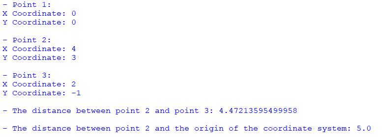

## Description
This Python program focuses on implementing a Point class that represents points in a two-dimensional (2D) Cartesian coordinate system. The Point class includes functionalities to create points, modify their coordinates, calculate distances between points, and compute the distance from a point to the origin of the coordinate system.
## Output

